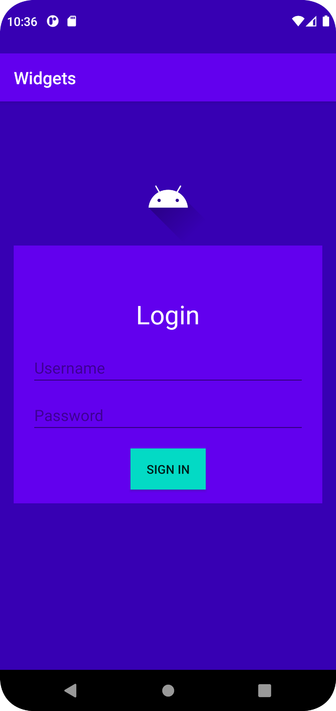

# Rapport

Skapade en inloggningsskärm med en imageview som använder sig av constraintlayout för att positioneras.
Själva inloggninsinputen och knappen ligger i en linearlayout då de bara ska bli stackade på varandra.

XML för att skapa en Linearlayout som ska stacka alla komponenter i sig.
``
    <LinearLayout
    android:layout_marginHorizontal="16dp"
    android:orientation="vertical"
    app:layout_constraintTop_toBottomOf="@+id/image"
    app:layout_constraintStart_toStartOf="parent"
    app:layout_constraintEnd_toEndOf="parent"
    android:layout_width="match_parent"
    android:layout_height="wrap_content"
    android:background="@color/colorPrimary">
``

Läs gärna:

- Boulos, M.N.K., Warren, J., Gong, J. & Yue, P. (2010) Web GIS in practice VIII: HTML5 and the canvas element for interactive online mapping. International journal of health geographics 9, 14. Shin, Y. &
- Wunsche, B.C. (2013) A smartphone-based golf simulation exercise game for supporting arthritis patients. 2013 28th International Conference of Image and Vision Computing New Zealand (IVCNZ), IEEE, pp. 459–464.
- Wohlin, C., Runeson, P., Höst, M., Ohlsson, M.C., Regnell, B., Wesslén, A. (2012) Experimentation in Software Engineering, Berlin, Heidelberg: Springer Berlin Heidelberg.
